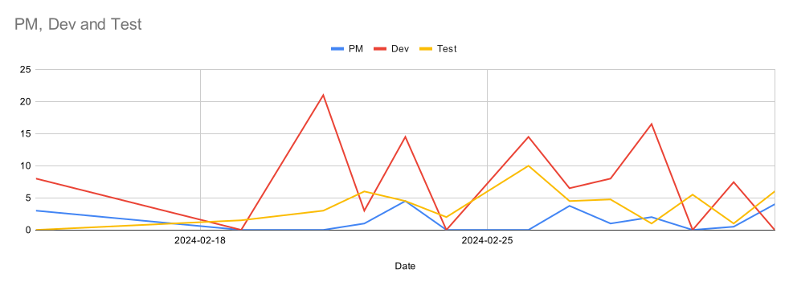
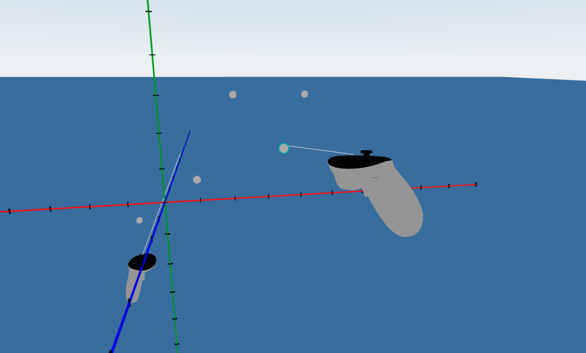
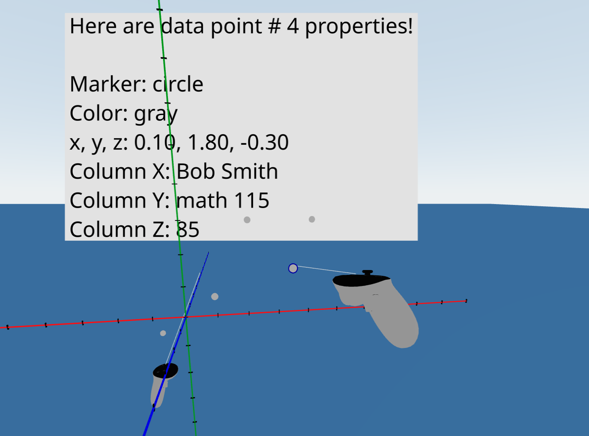

# Artifacts and Summary for ID3

## ID2 Summary
### Team Roles ID2
| Name                    	| Team 	|            Role 	|
|-------------------------	|-----:	|----------------:	|
| Matthew Buglass         	| N/A  	| Project Manager 	|
| Jesse Haug              	| Dev  	| Dev Lead        	|
| Aesha Patel             	| Dev  	| Risk Officer    	|
| Trang Nguyen            	| Dev  	| Build Master    	|
| Long Quan (Tony) Nguyen 	| Dev  	| Design Lead     	|
| Mitchell Wagner         	| QA   	| Test Lead       	|
| Joe Mbonayo             	| QA  	|                 	|
| Zander Rommelaere       	| QA  	| Build Master    	|
| Quinn Brown             	| QA  	| Risk Officer    	|

### Included PDF Documents
- [Retro ID2 - Jamboard](./id2_retro_jamboard.pdf)
- [Retro ID2 - Meeting Minutes](./id2_retro_minutes.pdf)
- [ID3 Activity Log](./id3_activity_log.pdf)
- [ID3 Data layer abstraction](./id3_data_layer_abstraction_design.pdf)
- [ID3 Design Jam Minutes](./id3_design_jam_minutes.pdf)
- [ID3 Requirements](./id3_requirements.pdf)
- [ID3 Risk Analysis](./id3_risk_analysis.pdf)
- [ID3 Stakeholder Meeting Minutes Feb 15th](./id3_stakeholder_meeting_feb_15.pdf)
- [ID3 Stakeholder Meeting Minutes Feb 29th](./id3_stakeholder_meeting_feb_29.pdf)
- [ID3 Test List](./id3_test_list.pdf)
- [ID3 Test Matrix](./id3_test_matrix.pdf)
- [ID3 Teat Team Update](./id3_test_team_update.pdf)

### Knowledge Sharing and Pairing Sessions:
We have a group shared calendar to book meetings, standups, and pairing sessions.

#### Artifact Inspection - Zander
- Duration: 1hr
- Attended by: Zander, Aesha, Jesse, Mitchell
- Inspected Zander's EsLint integration

#### Artifact Inspection - Jesse
- Duration: 1hr
- Attended by: Jesse, Mitchell, Joe, Trang
- Inspected Jesse's integration for displaying points in 3D space

#### PM Pairing Session
- Duration: 2.5hrs
- Attended by: Trang, Matthew
- Paried on tasks for backlog refinement, sprint planning and backlog grooming for ID2, and preparing the ID1 presentation.

#### Design Jam
- Duration: 4.5hrs
- Attended by: Aesha, Trang, Quinn, Tony, Jesse, Matt
- Caught up the team on what is in the repo, and worked on a data layer design as a team. This served as a 
meeting to ground everyone and ensure that we have a firm footings going into the last half of the term.

#### Assertion and Design Pairing
- Duration: 3hrs
- Attended by: Tony, Matt
- Met to discuss the implementation of assertions, and general logic abstractions to facilitate the implementation of out CSV readers.

#### Synchronous Code Review
- Duration: 1.5hrs
- Attended by: Trang, Tony, Matt
- Met after standup to address and discuss some finer points related to a couple PRs and organizing the DAL implementation.

#### Axis design
- Duration: 1hr
- Attended by: Jesse, Quinn
- Met to discuss the implementation of the 3D axes and placing data points within them

#### General Code Overview
- Duration: 1hr
- Attended by: Trang, Aesha
- Looked at the code in general

#### Unit Testing Pairing
- Duration: 1hr
- Attended by: Trang, Aesha
- Looked at data point unit testing

#### Datapoint debugging
- Duration: 1hr
- Attended by: Aesha, Zander
- debug datapoint fields, review unit tests

#### Risk plan update
- Duration: 1hr
- Attended by: Aesha, Quinn
- updated risk plan

#### Gherkin Pairing
- Duration: 1hr
- Attended by: Mitchell, Quinn
- Walked through how to create and review gherkin

### Card and Work Summary
The goal of ID3 was going to be focused integrating the discrete components that we built in ID2. In ID3 we planmed to have a full vertical slice of the system MVP: load into VR, load csv, and show data on axes. Furthermore, we planned to start inteplementing the backend componenets for PCA, and missing data filtering.

#### Mini-Milestones / Work Cards
These are the cards that we commited do and that came up in the sprint. They were estimated using planning poker at our retro meeting. Actual time tracking was done through out activity log.

|Title                                                                                  |URL                                                                                   |Assignees                |Status     |Labels            |Linked pull requests                                                                                                                                                      |Estimate (hrs)|Actual (hrs)|
|---------------------------------------------------------------------------------------|--------------------------------------------------------------------------------------|-------------------------|-----------|------------------|--------------------------------------------------------------------------------------------------------------------------------------------------------------------------|--------------|------------|
|Implement data switching                                                               |https://github.com/UniversityOfSaskatchewanCMPT371/term-project-2024-team-2/issues/15 |                         |Todo       |Required          |                                                                                                                                                                          |7             |            |
|Integrate Showing the data in 3D space                                                 |https://github.com/UniversityOfSaskatchewanCMPT371/term-project-2024-team-2/issues/13 |Jesster2829, MitchWag01  |Done       |ID3, Required     |                                                                                                                                                                          |4             |            |
|Implement backend data exclusion for rows with missing data                            |https://github.com/UniversityOfSaskatchewanCMPT371/term-project-2024-team-2/issues/22 |trangnguyen3010          |Done       |High Priority     |https://github.com/UniversityOfSaskatchewanCMPT371/term-project-2024-team-2/pull/151                                                                                      |4             |15          |
|Implement backend for PCA                                                              |https://github.com/UniversityOfSaskatchewanCMPT371/term-project-2024-team-2/issues/24 |LongQuanNguyen           |Done       |High Priority     |https://github.com/UniversityOfSaskatchewanCMPT371/term-project-2024-team-2/pull/136                                                                                      |12            |            |
|Refactor CSV reader                                                                    |https://github.com/UniversityOfSaskatchewanCMPT371/term-project-2024-team-2/issues/147|LongQuanNguyen           |Done       |ID3               |https://github.com/UniversityOfSaskatchewanCMPT371/term-project-2024-team-2/pull/148                                                                                      |              |            |
|UI interaction for point details                                                       |https://github.com/UniversityOfSaskatchewanCMPT371/term-project-2024-team-2/issues/26 |Aesha7                   |Done       |High Priority     |https://github.com/UniversityOfSaskatchewanCMPT371/term-project-2024-team-2/pull/145                                                                                      |6             |            |
|Artifact Inspection: Jesse                                                             |https://github.com/UniversityOfSaskatchewanCMPT371/term-project-2024-team-2/issues/90 |Jesster2829              |Done       |inspection        |                                                                                                                                                                          |1             |            |
|Fix Jest issue with ReactThreeFiber's implementation of Drei's Text component          |https://github.com/UniversityOfSaskatchewanCMPT371/term-project-2024-team-2/issues/117|Joembonayo               |In Progress|ID3, QA           |                                                                                                                                                                          |5             |            |
|Write Gherkin for a happy path-test of data display and integration                    |https://github.com/UniversityOfSaskatchewanCMPT371/term-project-2024-team-2/issues/118|MitchWag01               |Blocked    |Gherkin, ID3      |                                                                                                                                                                          |1             |            |
|Write Gherkin for PCA backend                                                          |https://github.com/UniversityOfSaskatchewanCMPT371/term-project-2024-team-2/issues/120|Joembonayo               |Todo       |Gherkin, ID3      |                                                                                                                                                                          |1             |            |
|Write Gherkin for UI interaction with a data point                                     |https://github.com/UniversityOfSaskatchewanCMPT371/term-project-2024-team-2/issues/121|qpb948                   |In Review  |Gherkin, ID3      |                                                                                                                                                                          |1             |            |
|CICD: deploy production review does not post a comment reporting the preview URL on PR |https://github.com/UniversityOfSaskatchewanCMPT371/term-project-2024-team-2/issues/123|trangnguyen3010          |Done       |bug, CI/CD        |https://github.com/UniversityOfSaskatchewanCMPT371/term-project-2024-team-2/pull/141                                                                                      |1             |            |
|Write Gherkin for Data exclusion                                                       |https://github.com/UniversityOfSaskatchewanCMPT371/term-project-2024-team-2/issues/119|Subzeero                 |Blocked    |Gherkin, ID3      |                                                                                                                                                                          |1             |            |
|`Vite` and `log4js` incompatibility                                                    |https://github.com/UniversityOfSaskatchewanCMPT371/term-project-2024-team-2/issues/122|Subzeero                 |In Progress|bug, ID3, Required|                                                                                                                                                                          |3             |            |
|Create ESLint CI/CD                                                                    |https://github.com/UniversityOfSaskatchewanCMPT371/term-project-2024-team-2/issues/64 |Subzeero                 |Done       |CI/CD, ID2        |https://github.com/UniversityOfSaskatchewanCMPT371/term-project-2024-team-2/pull/146                                                                                      |2             |9           |
|Investigate our build/smoke test not failing when it should have                       |https://github.com/UniversityOfSaskatchewanCMPT371/term-project-2024-team-2/issues/135|Subzeero                 |Done       |bug, CI/CD, ID3   |https://github.com/UniversityOfSaskatchewanCMPT371/term-project-2024-team-2/pull/146, https://github.com/UniversityOfSaskatchewanCMPT371/term-project-2024-team-2/pull/152|4             |4           |
|Remove support for Node.js 16                                                          |https://github.com/UniversityOfSaskatchewanCMPT371/term-project-2024-team-2/issues/143|Subzeero                 |Done       |CI/CD, enhancement|https://github.com/UniversityOfSaskatchewanCMPT371/term-project-2024-team-2/pull/149                                                                                      |1             |1           |
|Clean up npm dependencies                                                              |https://github.com/UniversityOfSaskatchewanCMPT371/term-project-2024-team-2/issues/144|Subzeero                 |Done       |enhancement       |https://github.com/UniversityOfSaskatchewanCMPT371/term-project-2024-team-2/pull/150                                                                                      |1             |1           |
|Artifact Inspection: Zander                                                            |https://github.com/UniversityOfSaskatchewanCMPT371/term-project-2024-team-2/issues/88 |Subzeero                 |Done       |ID3, inspection   |                                                                                                                                                                          |1             |1           |
|Deploy to Firebase production action failed to trigger                                 |https://github.com/UniversityOfSaskatchewanCMPT371/term-project-2024-team-2/issues/132|Subzeero                 |In Progress|bug, CI/CD, ID3   |https://github.com/UniversityOfSaskatchewanCMPT371/term-project-2024-team-2/pull/142                                                                                      |1             |            |
|Implement Smoke testing                                                                |https://github.com/UniversityOfSaskatchewanCMPT371/term-project-2024-team-2/issues/137|MitchWag01               |Todo       |CI/CD, ID3, test  |                                                                                                                                                                          |4             |            |
|Make some higher level diagrams                                                        |https://github.com/UniversityOfSaskatchewanCMPT371/term-project-2024-team-2/issues/138|matthew-buglass          |Done       |documentation, ID3|                                                                                                                                                                          |3             |            |
|Need some updates or expansions on the ui design                                       |https://github.com/UniversityOfSaskatchewanCMPT371/term-project-2024-team-2/issues/139|                         |Todo       |documentation, ID3|                                                                                                                                                                          |3             |            |
|Create User Flow Diagram                                                               |https://github.com/UniversityOfSaskatchewanCMPT371/term-project-2024-team-2/issues/140|Jesster2829              |Done       |documentation, ID3|                                                                                                                                                                          |3             |            |
|Add ID3 artifacts                                                                      |https://github.com/UniversityOfSaskatchewanCMPT371/term-project-2024-team-2/issues/154|matthew-buglass          |Done       |documentation, ID3|                                                                                                                                                                          |4             |            |
|Merge ID3 branch into master for the ID3 submission                                    |https://github.com/UniversityOfSaskatchewanCMPT371/term-project-2024-team-2/issues/158|Subzeero, trangnguyen3010|In Review  |ID3               |https://github.com/UniversityOfSaskatchewanCMPT371/term-project-2024-team-2/pull/159                                                                                      |              |            |

Our work estiamtion this iteration was better. In the previous iteration, our actual time doubled our estimated time. This time around, on average we under-estimated by about 26%.

|Team                                                                                   |Expected Time                                                                         |Total Time               |Total To Est Ratio|
|---------------------------------------------------------------------------------------|--------------------------------------------------------------------------------------|-------------------------|------------------|
|PM                                                                                     |14                                                                                    |19.75                    |1.410714286       |
|Dev                                                                                    |76.5                                                                                  |99.45                    |1.3               |
|Test                                                                                   |43                                                                                    |49.75                    |1.156976744       |
|Total                                                                                  |133.5                                                                                 |168.95                   |1.265543071       |

Over the course of the sprint, we were able to get the test team more involded with some spikes and longer-term QA investigations. Our dev team's work was a little spikyer, but we attribute that to the break and other classes.

#### Full slice / Happy Path
We got close to a fuyll happy-path. We can diplay plotted points, scaled appropriately with the axis, and can select and display alternative information assiciated with the points. The part that we are missing is the loading of the dataset into 3D space. Our CSV reader does work, but it is not currently hooked up to the data layer abstraction.

#### Smoke Testing
We started spikes into smoke testing and contacted the maintainers of Playwrite and Jest for advice. Reaching out wasn't as dfruitful as we had hoped, but have plans to invest more-heavily next iteration. More details can be found in the [Test Update](./id3_test_team_update.pdf).

#### Backend Componenets
We were able to finish implementing the PCA analysis, though it is currently stand-alone and not connected to our data pipeline, that is coming in the next itteration. Out data filtering is implemented in our data pipeline, and is controlled by a boolena flag so that if we wanted to integrate special data handling for empy values, we can.

#### UI updates
No work was done on refreshing the UI design this print. Now that we are on the edge of a full happy path, we will be taking a closer look at improving and refining our UI/UX designs.

#### New Wiki Documents
- [Data Layer Abstraction (DAL) Design](https://github.com/UniversityOfSaskatchewanCMPT371/term-project-2024-team-2/wiki/Architecture-Design-Records-(ADRs)#5-data-access-layer-dal-abstraction-design)
- [User Flow Diagram](https://github.com/UniversityOfSaskatchewanCMPT371/term-project-2024-team-2/wiki/Architecture-Design-Records-(ADRs)#6-flow-diagram)
- [Risk Plan ID3](https://github.com/UniversityOfSaskatchewanCMPT371/term-project-2024-team-2/wiki/Risk-Plan-ID3)

#### Artifact Inspections
- [Artifact Inspection - Zander](https://github.com/UniversityOfSaskatchewanCMPT371/term-project-2024-team-2/wiki/Artifact-Inspections#artifact-inspection-zander)
- [Artifact Inspection - Jesse](https://github.com/UniversityOfSaskatchewanCMPT371/term-project-2024-team-2/wiki/Artifact-Inspections#artifact-inspection-jesse-haug)

### Class Standup Attendance
#### Februrary 13th, 2024
##### In Attendance
- Tony Nguyen
- Jesse Haug
- Mitchell Wagner
- Matthew Buglass
- Aesha Patel
- Trang Nguyen
- Quinn Brown
- Joe Mbonayo
- Zander Rommelaere
##### Absent

#### Februrary 15th, 2024
##### In Attendance
- Tony Nguyen
- Jesse Haug
- Mitchell Wagner
- Matthew Buglass
- Aesha Patel
- Trang Nguyen
- Quinn Brown
- Joe Mbonayo
- Zander Rommelaere
##### Absent

#### Februrary 27th, 2024
##### In Attendance
- Tony Nguyen
- Jesse Haug
- Mitchell Wagner
- Matthew Buglass
- Aesha Patel
- Trang Nguyen
- Quinn Brown
- Joe Mbonayo
- Zander Rommelaere
##### Absent

#### Februrary 29th, 2024
##### In Attendance
- Tony Nguyen
- Jesse Haug
- Mitchell Wagner
- Matthew Buglass
- Aesha Patel
- Trang Nguyen
- Quinn Brown
- Joe Mbonayo
- Zander Rommelaere
##### Absent

## ID4
### Work Planned
In ID4, we are planning an extension to we we wanted to achieve in ID3. By the end of ID4, we will have a fully-integrated happy-path test of loading and displaying data in the 3D space. We also aim to finish the smoke testing spike to automate our smoke testing as much as possible.

|Title                                                                                  |URL                                                                                   |Assignees                |Status     |Labels            |Linked pull requests                                                                |Estimate (hrs)|Actual (hrs)|
|---------------------------------------------------------------------------------------|--------------------------------------------------------------------------------------|-------------------------|-----------|------------------|------------------------------------------------------------------------------------|--------------|------------|
|Implement data switching                                                               |https://github.com/UniversityOfSaskatchewanCMPT371/term-project-2024-team-2/issues/15 |                         |Todo       |Required          |                                                                                    |7             |            |
|Scale 3D space                                                                         |https://github.com/UniversityOfSaskatchewanCMPT371/term-project-2024-team-2/issues/20 |                         |Todo       |High Priority     |                                                                                    |              |            |
|Implement UI-side PCA interactions                                                     |https://github.com/UniversityOfSaskatchewanCMPT371/term-project-2024-team-2/issues/23 |                         |Todo       |High Priority     |                                                                                    |              |            |
|Fix Jest issue with ReactThreeFiber's implementation of Drei's Text component          |https://github.com/UniversityOfSaskatchewanCMPT371/term-project-2024-team-2/issues/117|Joembonayo               |In Progress|ID3, QA           |                                                                                    |5             |            |
|Write Gherkin for a happy path-test of data display and integration                    |https://github.com/UniversityOfSaskatchewanCMPT371/term-project-2024-team-2/issues/118|MitchWag01               |Blocked    |Gherkin, ID3      |                                                                                    |1             |            |
|Write Gherkin for PCA backend                                                          |https://github.com/UniversityOfSaskatchewanCMPT371/term-project-2024-team-2/issues/120|Joembonayo               |Todo       |Gherkin, ID3      |                                                                                    |1             |            |
|Write Gherkin for Data exclusion                                                       |https://github.com/UniversityOfSaskatchewanCMPT371/term-project-2024-team-2/issues/119|Subzeero                 |Blocked    |Gherkin, ID3      |                                                                                    |1             |            |
|`Vite` and `log4js` incompatibility                                                    |https://github.com/UniversityOfSaskatchewanCMPT371/term-project-2024-team-2/issues/122|Subzeero                 |In Progress|bug, ID3, Required|                                                                                    |3             |            |
|Deploy to Firebase production action failed to trigger                                 |https://github.com/UniversityOfSaskatchewanCMPT371/term-project-2024-team-2/issues/132|Subzeero                 |In Progress|bug, CI/CD, ID3   |https://github.com/UniversityOfSaskatchewanCMPT371/term-project-2024-team-2/pull/142|1             |            |
|Implement Smoke testing                                                                |https://github.com/UniversityOfSaskatchewanCMPT371/term-project-2024-team-2/issues/137|MitchWag01               |Todo       |CI/CD, ID3, test  |                                                                                    |4             |            |
|Need some updates or expansions on the ui design                                       |https://github.com/UniversityOfSaskatchewanCMPT371/term-project-2024-team-2/issues/139|                         |Todo       |documentation, ID3|                                                                                    |3             |            |
|Hook up CSV loaders to the DAL                                                         |https://github.com/UniversityOfSaskatchewanCMPT371/term-project-2024-team-2/issues/162|                         |Todo       |Required          |                                                                                    |              |            |
|Implement the DAL                                                                      |https://github.com/UniversityOfSaskatchewanCMPT371/term-project-2024-team-2/issues/163|                         |Todo       |Required          |                                                                                    |              |            |
|Add ID4 Artifacts                                                                      |                                                                                      |                         |Todo       |                  |                                                                                    |              |            |
|Update risks for ID4                                                                   |                                                                                      |                         |Todo       |                  |                                                                                    |              |            |
|Hook up the data-point reading to the DAL                                              |https://github.com/UniversityOfSaskatchewanCMPT371/term-project-2024-team-2/issues/164|                         |Todo       |Required          |                                                                                    |              |            |

### ID3 Role Swaps
| Name                    	| Team 	|            Role 	|
|-------------------------	|-----:	|----------------:	|
| Matthew Buglass         	| N/A  	| Project Manager 	|
| Jesse Haug              	| Dev  	| Dev Lead        	|
| Joe Mbonayo             	| Dev  	|                 	|
| Zander Rommelaere       	| Dev  	| Build Master    	|
| Quinn Brown             	| Dev  	| Risk Officer    	|
| Mitchell Wagner         	| QA   	| Test Lead       	|
| Aesha Patel             	| QA  	| Risk Officer    	|
| Trang Nguyen            	| QA  	| Build Master    	|
| Long Quan (Tony) Nguyen 	| QA  	| Design Lead     	|
