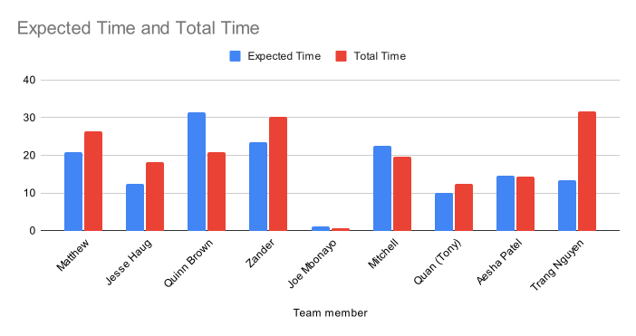
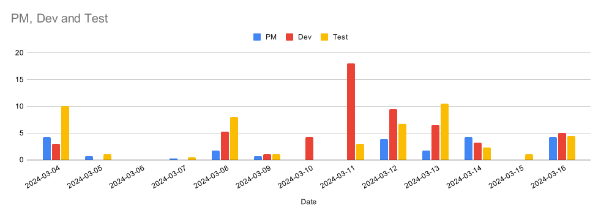
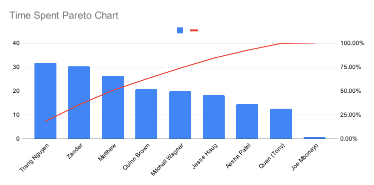

# Artifacts and Summary for ID4

## Table of Contents
- [Table of Contents](#table-of-contents)
- [ID4 Summary](#id4-summary)
  - [Team Roles ID4](#team-roles-id4)
  - [Included PDF Documents](#included-pdf-documents)
  - [Knowledge Sharing and Pairing Sessions](#knowledge-sharing-and-pairing-sessions)
  - [Card and Work Summary](#card-and-work-summary)
    - [Mini-Milestones / Work Cards](#mini-milestones--work-cards)
    - [Pre- and Post-Conditions](#pre--and-post-conditions)
    - [Multi-level Logging](#multi-level-logging)
    - [In progress PRs](#in-progress-prs)
    - [Activity Logging](#activity-logging)
    - [New Wiki Documents](#new-wiki-documents)
    - [Artifact Inspections](#artifact-inspections)
  - [Class Standup Attendance](#class-standup-attendance)
    - [March 5th, 2024](#march-5th-2024)
    - [March 7th, 2024](#march-7th-2024)
    - [March 12th, 2024](#march-12th-2024)
    - [March 14th, 2024](#march-14th-2024)
- [ID5 Plan](#id5-plan)
  - [Work Planned](#work-planned)
  - [ID5 Role Swaps](#id5-role-swaps)

## ID4 Summary
### Team Roles ID4
| Name                    	| Team 	|            Role 	|
|-------------------------	|-----:	|----------------:	|
| Matthew Buglass         	| N/A  	| Project Manager 	|
| Jesse Haug              	| Dev  	| Dev Lead        	|
| Joe Mbonayo             	| Dev  	|                 	|
| Zander Rommelaere       	| Dev  	| Build Master    	|
| Quinn Brown             	| Dev  	| Risk Officer    	|
| Mitchell Wagner         	| QA   	| Test Lead       	|
| Aesha Patel             	| QA   	| Risk Officer    	|
| Trang Nguyen            	| QA   	| Build Master    	|
| Long Quan (Tony) Nguyen 	| QA   	| Design Lead     	|

### Included PDF Documents
- [ID3 Retro Jamboard](./id3_retro_jamboard.pdf)
- [ID3 Retro Minutes](./id3_retro_minutes.pdf)
- [ID4 Data Abstraction Layer Update](./id4_data_abstraction_layer_update.pdf)
- [ID4 Risk Plan](./id4_risk_plan.pdf)
- [ID4 Stakeholder Meeting Mar 14](./id4_stakeholder_meeting_mar_14.pdf)
- [ID4 Stakeholder Meeting Mar 7](./id4_stakeholder_meeting_mar_7.pdf)
- [ID4 Test Coverage](./id4_test_coverage.pdf)
- [ID4 Test List](./id4_test_list.pdf)
- [ID4 Test Matrix](./id4_test_matrix.pdf)
- [ID4 Test Team Update](./id4_test_team_update.pdf)

### Knowledge Sharing and Pairing Sessions
We have a group shared calendar to book meetings, standups, and pairing sessions.

##### Artifact Inspection - Aesha
- Duration: 1hr
- Attended by: Zander, Aesha, Quinn, Matthew
- Inspected Aesha's updated UI designs

##### Jest/Drei Pairing
- Duration: 1hr
- Attended by: Trang, Joe
- Joe passed off what he had done for looking at the Jest/Drei test issue

##### Matt and Jesse 1-on-1
- Duration: 1hr
- Attended by: Matt and Jesse
- PM/Dev Lead check in to address any issues

##### Matt and Mitchell 1-on-1
- Duration: 1hr
- Attended by: Matt and Mitchell
- PM/Test Lead check in to address any issues

##### Matt and Trang PM pairing 
- Duration: 1hr
- Attended by: Trang and Matt
- Met to plan the sprint and discuss the last one

##### Tutorial Time and Planning Poker
- Duration: 1.5hr
- Attended by: Matt, Tony, Jesse, Trang, Quinn, Zander, Mitchell, Aesha
- Met with most of the team to conduct planning poker, and give tutorials on PCA and the DAL

##### Joe and Matt pairing
- Duration: 1hr
- Attended by: Matt, Joe
- Met with Joe to get his repo fixed and set him up for pre-and-post condition work.

##### Lead pairing
- Duration: 1hr
- Attended by: Matt, Mitchell, Jesse
- Met with Jesse and Mitchell to discuss project state before code freeze

##### Cross Team Pairing
- Duration: 1hr
- Attended by: Matt, Ardalan (Team 3)
- Met with Ardalan to go over and discuss PM challenges and activity log automations in Google Sheets/Excel

##### Zander and Matt Pairing
- Duration: 2.5hrs
- Attended by: Matt, Zander, with guest appearances of Mitchell, Aesha, and Quinn
- Met to trouble shoot Vite/Jest environment variable implementation issues.

##### DAL Pairing
- Duration: 2hrs
- Attended by: Jesse, Zander, Quinn
- Pair programmed the start of the DAL system, did some testing as well 

##### Chrome Warning Pairing
- Duration: 1.5hrs
- Attended by: Zander, Tony
- Investigate unsafe header warning in Chrome

##### Multi-level Logging Pairing
- Duration: 0.5hrs
- Attended by: Zander, Aesha
- Research options for multi-level level and make proposal

##### Rollbar Pairing
- Duration: 4.5hrs
- Attended by: Zander, Aesha
- Setup Rollbar accounts, replaced log4js methods, created LogAppender class for IndexedDB and testing

##### Test Hook SPIKE pairing
- Duration: 4.5hrs
- Attended by: Mitchell, Tony
- Walk through current test spike and how to complete

##### Smoke testing Brainstorm
- Duration: 3hrs
- Attended by: Mitchell, Tony, Matt
- Met to discuss testing feasibility and discuss options going forward.

##### Risk Plan update
- Duration: 0.5hrs
- Attended by: Aesha, Quinn
- Added new risks for ID4 and updated scores in risk plan

### Card and Work Summary
In ID4, we planned an extension to we we wanted to achieve in ID3. By the end of ID4, we wanted to have a fully-integrated happy-path test of loading and displaying data in the 3D space. We also aimed to finish the smoke testing spike to automate our smoke testing as much as possible. We got most of the way there, but again missed our mark. 

Good progress was made on the development front, but we discovered that our CSV loaders were not adequately load tested and crashed the browser when reading a file with half a million records and ten dimensions. That refactor, and development difficulties with transposing of the dataset to maintain within our 5Mibs of memory usage drastically slowed progress and prevented most of our dev work from getting over the finish line.

On the QA side, we had more success. We wrapped up two smoke testing SPIKEs and decided that creating a custom test hook to log internal states during manual testing and inspecting logs was going to be the most fruitful approach.

#### Mini-Milestones / Work Cards
These are the cards that we committed do and that came up in the sprint. They were estimated using planning poker at our retro meeting. Actual time tracking was done through our activity log.

|Title                                                                        |URL                                                                                   |Assignees                 |Status     |Labels                 |Linked pull requests|Estimate (hrs)                                                                      |Actual (hrs)|
|-----------------------------------------------------------------------------|--------------------------------------------------------------------------------------|--------------------------|-----------|-----------------------|--------------------|------------------------------------------------------------------------------------|------------|
|Implement Axis data choosing                                                 |https://github.com/UniversityOfSaskatchewanCMPT371/term-project-2024-team-2/issues/15 |qpb948                    |In Progress|ID4, Required          |https://github.com/UniversityOfSaskatchewanCMPT371/term-project-2024-team-2/pull/174|7                                                                                   |            |
|Artifact Inspection: Aesha                                                   |https://github.com/UniversityOfSaskatchewanCMPT371/term-project-2024-team-2/issues/89 |Aesha7                    |Done       |inspection             |                    |1                                                                                   |1           |
|Fix Jest issue with ReactThreeFiber's implementation of Drei's Text component|https://github.com/UniversityOfSaskatchewanCMPT371/term-project-2024-team-2/issues/117|trangnguyen3010           |In Progress|bug, ID4, QA           |https://github.com/UniversityOfSaskatchewanCMPT371/term-project-2024-team-2/pull/173|5                                                                                   |21          |
|Add EsLint as Webstorm Linter                                                |https://github.com/UniversityOfSaskatchewanCMPT371/term-project-2024-team-2/issues/169|trangnguyen3010           |Done       |CI/CD, ID4             |https://github.com/UniversityOfSaskatchewanCMPT371/term-project-2024-team-2/pull/175|1                                                                                   |1           |
|Write Gherkin for a happy path-test of data display and integration          |https://github.com/UniversityOfSaskatchewanCMPT371/term-project-2024-team-2/issues/118|MitchWag01                |Blocked    |Gherkin, ID3, ID4      |                    |1                                                                                   |            |
|Write Gherkin for PCA backend                                                |https://github.com/UniversityOfSaskatchewanCMPT371/term-project-2024-team-2/issues/120|Joembonayo                |Done       |Gherkin, ID4           |https://github.com/UniversityOfSaskatchewanCMPT371/term-project-2024-team-2/pull/172|1                                                                                   |            |
|Write Gherkin for Data exclusion                                             |https://github.com/UniversityOfSaskatchewanCMPT371/term-project-2024-team-2/issues/119|trangnguyen3010           |Blocked    |Gherkin, ID3, ID4      |                    |1                                                                                   |            |
|`Vite` and `log4js` incompatibility                                          |https://github.com/UniversityOfSaskatchewanCMPT371/term-project-2024-team-2/issues/122|Aesha7, Subzeero          |In Progress|bug, ID3, ID4, Required|https://github.com/UniversityOfSaskatchewanCMPT371/term-project-2024-team-2/pull/186|3                                                                                   |            |
|Deploy to Firebase production action failed to trigger                       |https://github.com/UniversityOfSaskatchewanCMPT371/term-project-2024-team-2/issues/132|Subzeero                  |In Progress|bug, CI/CD, ID3, ID4   |https://github.com/UniversityOfSaskatchewanCMPT371/term-project-2024-team-2/pull/142|1                                                                                   |            |
|Implement the DAL                                                            |https://github.com/UniversityOfSaskatchewanCMPT371/term-project-2024-team-2/issues/163|Subzeero                  |In Progress|ID4, Required          |https://github.com/UniversityOfSaskatchewanCMPT371/term-project-2024-team-2/pull/179|12                                                                                  |            |
|Implement Smoke testing                                                      |https://github.com/UniversityOfSaskatchewanCMPT371/term-project-2024-team-2/issues/137|LongQuanNguyen, MitchWag01|In Progress|CI/CD, ID3, ID4, test  |https://github.com/UniversityOfSaskatchewanCMPT371/term-project-2024-team-2/pull/192|4                                                                                   |            |
|Need some updates or expansions on the ui design                             |https://github.com/UniversityOfSaskatchewanCMPT371/term-project-2024-team-2/issues/139|Aesha7                    |Done       |documentation, ID3, ID4|                    |3                                                                                   |4           |
|Hook up CSV loaders to the DAL                                               |https://github.com/UniversityOfSaskatchewanCMPT371/term-project-2024-team-2/issues/162|Jesster2829               |In Progress|ID4, Required          |                    |3                                                                                   |0           |
|Add ID4 Artifacts                                                            |https://github.com/UniversityOfSaskatchewanCMPT371/term-project-2024-team-2/issues/167|matthew-buglass           |In Progress|documentation, ID4     |                    |4                                                                                   |            |
|SPIKE: Look into Frankenstein-ing The Emulator code to drive testing         |https://github.com/UniversityOfSaskatchewanCMPT371/term-project-2024-team-2/issues/183|matthew-buglass           |Done       |ID4                    |                    |5                                                                                   |            |
|Update risks for ID4                                                         |https://github.com/UniversityOfSaskatchewanCMPT371/term-project-2024-team-2/issues/168|Aesha7, qpb948            |Done       |documentation, ID4     |                    |1                                                                                   |1           |
|Hook up the data-point reading to the DAL                                    |https://github.com/UniversityOfSaskatchewanCMPT371/term-project-2024-team-2/issues/164|Jesster2829               |Todo       |ID4, Required          |                    |6                                                                                   |            |
|Creating patching policies                                                   |https://github.com/UniversityOfSaskatchewanCMPT371/term-project-2024-team-2/issues/166|matthew-buglass           |Done       |documentation, ID4     |                    |1                                                                                   |            |
|Investigate bug on CSV Load                                                  |https://github.com/UniversityOfSaskatchewanCMPT371/term-project-2024-team-2/issues/170|LongQuanNguyen, Subzeero  |Done       |bug, ID4               |                    |3                                                                                   |            |
|Handle duplicate column headers on data load                                 |https://github.com/UniversityOfSaskatchewanCMPT371/term-project-2024-team-2/issues/171|Joembonayo                |Todo       |enhancement, ID4       |                    |3                                                                                   |            |
|Add pre and post conditions to functions and methods                         |https://github.com/UniversityOfSaskatchewanCMPT371/term-project-2024-team-2/issues/182|Joembonayo, matthew-buglass|In Progress|documentation, enhancement, ID4|                    |3                                                                                   |            |
|Set up log based human-in-the-loop testing                                   |https://github.com/UniversityOfSaskatchewanCMPT371/term-project-2024-team-2/issues/184|                          |Won't Do   |ID4, test              |                    |                                                                                    |            |
|Create PR for ID4 release                                                    |https://github.com/UniversityOfSaskatchewanCMPT371/term-project-2024-team-2/issues/188|matthew-buglass           |Done       |ID4                    |https://github.com/UniversityOfSaskatchewanCMPT371/term-project-2024-team-2/pull/189|                                                                                    |            |

#### Pre- and Post-Conditions
Developers are going to be paying more attention to add pre- and post- conditions to their code, and we have an active card to go back through the code base to add them to existing code.

#### Multi-level Logging
It was determined that Log4js is incompatible with Vite. A decision was made to switch our logging framework to Rollbar. However, it was not merged in this deliverable as, due to how Vite and Jest reference environment variables, we were not able to get the application working and the tests passing at the same time.

#### In progress PRs
Due to unforeseen complications and life, there were many pieces of work that had a lot of effort, but weren't able to get over the finish line. We still put them up in draft to get feedback and increase visibility.

|Title                                                                        |URL                                                                                   |Assignees                 |Status     |Labels                 |Sprint|Linked pull requests                                                                |
|-----------------------------------------------------------------------------|--------------------------------------------------------------------------------------|--------------------------|-----------|-----------------------|------|------------------------------------------------------------------------------------|
|Implement Axis data choosing                                                 |https://github.com/UniversityOfSaskatchewanCMPT371/term-project-2024-team-2/issues/15 |qpb948                    |In Progress|ID4, Required          |ID 4  |https://github.com/UniversityOfSaskatchewanCMPT371/term-project-2024-team-2/pull/174|
|Fix Jest issue with ReactThreeFiber's implementation of Drei's Text component|https://github.com/UniversityOfSaskatchewanCMPT371/term-project-2024-team-2/issues/117|trangnguyen3010           |In Progress|bug, ID4, QA           |ID 4  |https://github.com/UniversityOfSaskatchewanCMPT371/term-project-2024-team-2/pull/173|
|`Vite` and `log4js` incompatibility                                          |https://github.com/UniversityOfSaskatchewanCMPT371/term-project-2024-team-2/issues/122|Aesha7, Subzeero          |In Progress|bug, ID3, ID4, Required|ID 4  |https://github.com/UniversityOfSaskatchewanCMPT371/term-project-2024-team-2/pull/186|
|Deploy to Firebase production action failed to trigger                       |https://github.com/UniversityOfSaskatchewanCMPT371/term-project-2024-team-2/issues/132|Subzeero                  |In Progress|bug, CI/CD, ID3, ID4   |ID 4  |https://github.com/UniversityOfSaskatchewanCMPT371/term-project-2024-team-2/pull/142|
|Implement the DAL                                                            |https://github.com/UniversityOfSaskatchewanCMPT371/term-project-2024-team-2/issues/163|Subzeero                  |In Progress|ID4, Required          |ID 4  |https://github.com/UniversityOfSaskatchewanCMPT371/term-project-2024-team-2/pull/179|
|Implement Smoke testing                                                      |https://github.com/UniversityOfSaskatchewanCMPT371/term-project-2024-team-2/issues/137|LongQuanNguyen, MitchWag01|In Progress|CI/CD, ID3, ID4, test  |ID 4  |https://github.com/UniversityOfSaskatchewanCMPT371/term-project-2024-team-2/pull/192|

#### Activity Logging
A full list of Activity logs can be found [here](), but we provide the summary tables here.

##### Actual vs Expected Time
|Team                                                                         |Expected Time                                                                         |Total Time                |Total To Est Ratio|
|-----------------------------------------------------------------------------|--------------------------------------------------------------------------------------|--------------------------|------------------|
|PM                                                                           |20.75                                                                                 |26.40                     |1.272             |
|Dev                                                                          |68.50                                                                                 |70.00                     |1.022             |
|Test                                                                         |60.50                                                                                 |78.45                     |1.297             |
|Total                                                                        |149.75                                                                                |174.85                    |1.168             |

|Team member                                                                  |Expected Time                                                                         |Total Time                |Total To Est Ratio|Relative Time|
|-----------------------------------------------------------------------------|--------------------------------------------------------------------------------------|--------------------------|------------------|-------------|
|Matthew Buglass                                                              |20.75                                                                                 |26.4                      |1.272             |135.89%      |
|Jesse Haug                                                                   |12.5                                                                                  |18.25                     |1.460             |93.94%       |
|Quinn Brown                                                                  |31.5                                                                                  |20.75                     |0.659             |106.81%      |
|Zander Rommelaere                                                            |23.5                                                                                  |30.25                     |1.287             |155.70%      |
|Joe Mbonayo                                                                  |1                                                                                     |0.75                      |0.750             |3.86%        |
|Mitchell Wagner                                                              |22.5                                                                                  |19.75                     |0.878             |101.66%      |
|Quan (Tony) Nguyen                                                           |10                                                                                    |12.5                      |1.250             |64.34%       |
|Aesha Patel                                                                  |14.5                                                                                  |14.45                     |0.997             |74.38%       |
|Trang Nguyen                                                                 |13.5                                                                                  |31.75                     |2.352             |163.43%      |
|Average                                                                      |16.64                                                                                 |19.43                     |1.168             |100.00%      |

##### Summary Charts

#### New Wiki Documents
- [Data Abstraction Layer Design - Updated](https://github.com/UniversityOfSaskatchewanCMPT371/term-project-2024-team-2/wiki/Architecture-Design-Records-(ADRs)#5-data-access-layer-dal-abstraction-design)
  - We decided to store PCA columns in a separate table, instead of with the raw data

#### Artifact Inspections
- [Artifact Inspection - Aesha](https://github.com/UniversityOfSaskatchewanCMPT371/term-project-2024-team-2/wiki/Artifact-Inspections#artifact-inspection-aesha-patel)

### Class Standup Attendance
#### March 5th, 2024
##### In Attendance
- Tony Nguyen
- Jesse Haug
- Mitchell Wagner
- Matthew Buglass
- Aesha Patel
- Trang Nguyen
- Quinn Brown
- Joe Mbonayo
- Zander Rommelaere
##### Absent

#### March 7th, 2024
##### In Attendance
- Tony Nguyen
- Jesse Haug
- Mitchell Wagner
- Matthew Buglass
- Aesha Patel
- Trang Nguyen
- Quinn Brown
- Joe Mbonayo
- Zander Rommelaere
##### Absent

#### March 12th, 2024
##### In Attendance
- Tony Nguyen
- Jesse Haug
- Mitchell Wagner
- Matthew Buglass
- Aesha Patel
- Trang Nguyen
- Quinn Brown
- Joe Mbonayo
- Zander Rommelaere
##### Absent

#### March 14th, 2024
##### In Attendance
- Tony Nguyen
- Jesse Haug
- Mitchell Wagner
- Matthew Buglass
- Aesha Patel
- Trang Nguyen
- Quinn Brown
- Zander Rommelaere
##### Absent
- Joe Mbonayo

## ID5 Plan
### Work Planned
In ID5, we're having a bit of a Ground Hog's Day phenomena. Again, we will be trying to finish up that vertical slice and implement our custom testing hooks. The current card plan is subject to change, and will likely be paired down. The biggest issue of note is a discussion on changing our testing framework. Because we could not access environment variables in both Jest and when running under Vite, we are at a decision point or which path to commit to. As for right now, moving from Jest to Vitest seems like the smoothest path, as Vitest claims to have a Jest-compatible interface.

|Title                                                                        |URL                                                                                   |Assignees                 |Status     |Labels                 |Linked pull requests|Estimate (hrs)                                                                      |Actual (hrs)|
|-----------------------------------------------------------------------------|--------------------------------------------------------------------------------------|--------------------------|-----------|-----------------------|--------------------|------------------------------------------------------------------------------------|------------|
|Implement Axis data choosing                                                 |https://github.com/UniversityOfSaskatchewanCMPT371/term-project-2024-team-2/issues/15 |qpb948                    |In Progress|ID4, Required          |https://github.com/UniversityOfSaskatchewanCMPT371/term-project-2024-team-2/pull/174|7                                                                                   |            |
|Artifact Inspection: Aesha                                                   |https://github.com/UniversityOfSaskatchewanCMPT371/term-project-2024-team-2/issues/89 |Aesha7                    |Done       |inspection             |                    |1                                                                                   |1           |
|Fix Jest issue with ReactThreeFiber's implementation of Drei's Text component|https://github.com/UniversityOfSaskatchewanCMPT371/term-project-2024-team-2/issues/117|trangnguyen3010           |In Progress|bug, ID4, QA           |https://github.com/UniversityOfSaskatchewanCMPT371/term-project-2024-team-2/pull/173|5                                                                                   |21          |
|Add EsLint as Webstorm Linter                                                |https://github.com/UniversityOfSaskatchewanCMPT371/term-project-2024-team-2/issues/169|trangnguyen3010           |Done       |CI/CD, ID4             |https://github.com/UniversityOfSaskatchewanCMPT371/term-project-2024-team-2/pull/175|1                                                                                   |1           |
|Write Gherkin for a happy path-test of data display and integration          |https://github.com/UniversityOfSaskatchewanCMPT371/term-project-2024-team-2/issues/118|MitchWag01                |Blocked    |Gherkin, ID3, ID4      |                    |1                                                                                   |            |
|Write Gherkin for PCA backend                                                |https://github.com/UniversityOfSaskatchewanCMPT371/term-project-2024-team-2/issues/120|Joembonayo                |Done       |Gherkin, ID4           |https://github.com/UniversityOfSaskatchewanCMPT371/term-project-2024-team-2/pull/172|1                                                                                   |            |
|Write Gherkin for Data exclusion                                             |https://github.com/UniversityOfSaskatchewanCMPT371/term-project-2024-team-2/issues/119|trangnguyen3010           |Blocked    |Gherkin, ID3, ID4      |                    |1                                                                                   |            |
|`Vite` and `log4js` incompatibility                                          |https://github.com/UniversityOfSaskatchewanCMPT371/term-project-2024-team-2/issues/122|Aesha7, Subzeero          |In Progress|bug, ID3, ID4, Required|https://github.com/UniversityOfSaskatchewanCMPT371/term-project-2024-team-2/pull/186|3                                                                                   |            |
|Deploy to Firebase production action failed to trigger                       |https://github.com/UniversityOfSaskatchewanCMPT371/term-project-2024-team-2/issues/132|Subzeero                  |In Progress|bug, CI/CD, ID3, ID4   |https://github.com/UniversityOfSaskatchewanCMPT371/term-project-2024-team-2/pull/142|1                                                                                   |            |
|Implement the DAL                                                            |https://github.com/UniversityOfSaskatchewanCMPT371/term-project-2024-team-2/issues/163|Subzeero                  |In Progress|ID4, Required          |https://github.com/UniversityOfSaskatchewanCMPT371/term-project-2024-team-2/pull/179|12                                                                                  |            |
|Implement Smoke testing                                                      |https://github.com/UniversityOfSaskatchewanCMPT371/term-project-2024-team-2/issues/137|LongQuanNguyen, MitchWag01|In Progress|CI/CD, ID3, ID4, test  |https://github.com/UniversityOfSaskatchewanCMPT371/term-project-2024-team-2/pull/192|4                                                                                   |            |
|Need some updates or expansions on the ui design                             |https://github.com/UniversityOfSaskatchewanCMPT371/term-project-2024-team-2/issues/139|Aesha7                    |Done       |documentation, ID3, ID4|                    |3                                                                                   |4           |
|Hook up CSV loaders to the DAL                                               |https://github.com/UniversityOfSaskatchewanCMPT371/term-project-2024-team-2/issues/162|Jesster2829               |In Progress|ID4, Required          |                    |3                                                                                   |0           |
|Add ID4 Artifacts                                                            |https://github.com/UniversityOfSaskatchewanCMPT371/term-project-2024-team-2/issues/167|matthew-buglass           |In Progress|documentation, ID4     |                    |4                                                                                   |            |
|SPIKE: Look into Frankenstein-ing The Emulator code to drive testing         |https://github.com/UniversityOfSaskatchewanCMPT371/term-project-2024-team-2/issues/183|matthew-buglass           |Done       |ID4                    |                    |5                                                                                   |            |
|Update risks for ID4                                                         |https://github.com/UniversityOfSaskatchewanCMPT371/term-project-2024-team-2/issues/168|Aesha7, qpb948            |Done       |documentation, ID4     |                    |1                                                                                   |1           |
|Hook up the data-point reading to the DAL                                    |https://github.com/UniversityOfSaskatchewanCMPT371/term-project-2024-team-2/issues/164|Jesster2829               |Todo       |ID4, Required          |                    |6                                                                                   |            |
|Creating patching policies                                                   |https://github.com/UniversityOfSaskatchewanCMPT371/term-project-2024-team-2/issues/166|matthew-buglass           |Done       |documentation, ID4     |                    |1                                                                                   |            |
|Investigate bug on CSV Load                                                  |https://github.com/UniversityOfSaskatchewanCMPT371/term-project-2024-team-2/issues/170|LongQuanNguyen, Subzeero  |Done       |bug, ID4               |                    |3                                                                                   |            |
|Handle duplicate column headers on data load                                 |https://github.com/UniversityOfSaskatchewanCMPT371/term-project-2024-team-2/issues/171|Joembonayo                |Todo       |enhancement, ID4       |                    |3                                                                                   |            |
|Add pre and post conditions to functions and methods                         |https://github.com/UniversityOfSaskatchewanCMPT371/term-project-2024-team-2/issues/182|Joembonayo, matthew-buglass|In Progress|documentation, enhancement, ID4|                    |3                                                                                   |            |
|Set up log based human-in-the-loop testing                                   |https://github.com/UniversityOfSaskatchewanCMPT371/term-project-2024-team-2/issues/184|                          |Won't Do   |ID4, test              |                    |                                                                                    |            |
|Create PR for ID4 release                                                    |https://github.com/UniversityOfSaskatchewanCMPT371/term-project-2024-team-2/issues/188|matthew-buglass           |Done       |ID4                    |https://github.com/UniversityOfSaskatchewanCMPT371/term-project-2024-team-2/pull/189|                                                                                    |            |

### ID5 Role Swaps
| Name                    	| Team 	|            Role 	|
|-------------------------	|-----:	|----------------:	|
| Matthew Buglass         	| N/A  	| Project Manager 	|
| Jesse Haug              	| Dev  	| Dev Lead        	|
| Aesha Patel             	| Dev  	| Risk Officer    	|
| Trang Nguyen            	| Dev  	| Build Master    	|
| Long Quan (Tony) Nguyen 	| Dev  	| Design Lead     	|
| Mitchell Wagner         	| QA   	| Test Lead       	|
| Joe Mbonayo             	| QA  	|                 	|
| Zander Rommelaere       	| QA  	| Build Master    	|
| Quinn Brown             	| QA  	| Risk Officer    	|
