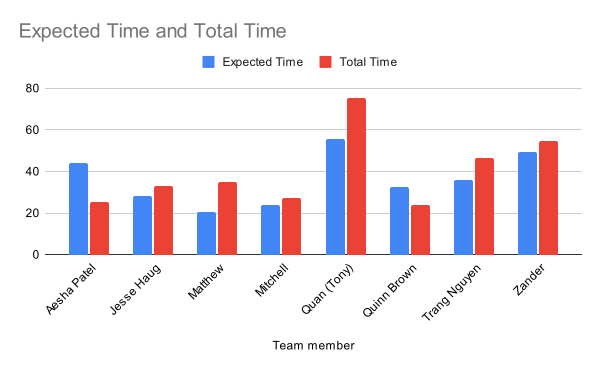

# Artifacts and Summary for ID5

## Table of Contents
- [Table of Contents](#table-of-contents)
- [ID5 Summary](#id5-summary)
  - [Team Roles ID5](#team-roles-id5)
  - [Included PDF Documents](#included-pdf-documents)
  - [Knowledge Sharing and Pairing Sessions](#knowledge-sharing-and-pairing-sessions)
  - [Card and Work Summary](#card-and-work-summary)
    - [Mini-Milestones / Work Cards](#mini-milestones--work-cards)
    - [Pre- and Post-Conditions](#pre--and-post-conditions)
    - [Multi-level Logging](#multi-level-logging)
    - [Activity Logging](#activity-logging)
    - [New Wiki Documents](#new-wiki-documents)
    - [Artifact Inspections](#artifact-inspections)
  - [Class Standup Attendance](#class-standup-attendance)
    - [March 5th, 2024](#march-5th-2024)
    - [March 7th, 2024](#march-7th-2024)
    - [March 12th, 2024](#march-12th-2024)
    - [March 14th, 2024](#march-14th-2024)
- [Project Reflection](#project-reflection)
  - [Undiagnosed bugs](#undiagnosed-bugs)
  - [Deprioritized Work](#deprioritized-work)

## ID5 Summary
### Team Roles ID5
| Name                    	| Team 	|            Role 	|
|-------------------------	|-----:	|----------------:	|
| Matthew Buglass         	| N/A  	| Project Manager 	|
| Jesse Haug              	| Dev  	| Dev Lead        	|
| Aesha Patel             	| Dev  	| Risk Officer    	|
| Trang Nguyen            	| Dev  	| Build Master    	|
| Long Quan (Tony) Nguyen 	| Dev  	| Design Lead     	|
| Mitchell Wagner         	| QA   	| Test Lead       	|
| Zander Rommelaere       	| QA  	| Build Master    	|
| Quinn Brown             	| QA  	| Risk Officer    	|

### Included PDF Documents
- [ID4 Retro Jamboard](./id4_retro_jamboard.pdf)
- [ID4 Retro Minutes](./id4_retro_minutes.pdf)
- [ID5 Activity Log](./id5_activity_log.pdf)
- [ID5 CI/CD Flow Map](./id5_cicd_flow_map.pdf)
- [ID5 Developer Update](./id5_developer_update.pdf)
- [ID5 QA Update](./id5_qa_update.pdf)
- [ID5 Requirements](./id5_requirements.pdf)
- [ID5 Risk Update](./id5_risk_update.pdf)
- [ID5 Stakeholder Meeting March 21](./id5_stakeholder_meeting_March_21.pdf)
- [ID5 Stakeholder Meeting March 28](./id5_stakeholder_meeting_March_28.pdf)
- [ID5 User Flow Diagram Update](./id5_user_flow_diagram_update.pdf)

### Knowledge Sharing and Pairing Sessions
We have a group shared calendar to book meetings, standups, and pairing sessions. The word "pair" appears 64 times in our activity log, so we provide an abbridged summary of pairing activities here. A full list can be found in the activity log.

##### Artifact Inspection - Trang
- Duration: 45 mins
- Attended by: Trang, Tony, Jesse, Matthew
- Inspected Trang's Drei fix

##### Artifact Inspection - Quinn
- Duration: 30 mins
- Attended by: Quinn, Jesse, Matthew, Mitchell
- Inspected Quinn's smoke test

##### PM Pairing
- Duration: 1 hr
- Attended by: Matthew, Trang
- Discussed project wrap up and post-mortem structure

##### Planning Poker
- Duration: 45mins
- Attended by: Matthew, Jesse, Aesha, Trang, Tony, Mitchell, Zander, Quinn
- Met with the team to plan and estimate cards

##### Bug Party
- Duration: 1.5 hrs
- Attended by: Mitchell, Zander, Quinn, Trang, Tony, Aesha, Matthew
- Split into two teams, one with the Quest 2 and the other with the Quest 3 to find bugs in the system.

##### Test Pairing 
- Duration: 2 hrs
- Attended by: Matthew, Mitchell
- Met to discuss path testing and estimating undiagnosed bugs.

##### DAL Pairing
- Duration: 1
- Attended by: Jesse, TrRang, Tony, Aesha
- Dev team met to pair on the implementation of the DAL

##### CSV Reader pairing
- Duration: 11 hrs (cumulative)
- Attended by: Jesse, Tony
- Met over several sessions to work on the CSV readers

##### Merge Party
- Duration: 3
- Attended by: Jesse, Aesha, Tony, Trang
- Dev team met to coordinate and solve merge conflicts

##### Smoke test pairing
- Duration: 4 hrs
- Attended by: Zander, Quinn
- Test team met to go over and build human-in-the-loop smoke tests.

##### Axes Selction pairing
- Duration: 13.5 hrs (cumulative)
- Attended by: Trang, Quinn, Tony, Zander, Aesha
- Cross-sub-team collaboration on incoporating data selection

### Card and Work Summary

#### Mini-Milestones / Work Cards
These are the cards that we committed do and that came up in the sprint. They were estimated using planning poker at our retro meeting. Actual time tracking was done through our activity log.

In ID5, we aimed to finish up the vertical slice MVP of the system and implement our custom testing hooks. 

The biggest issue of note was the changing of our testing framework. Because we could not access environment variables in both Jest and when running under Vite, we decided to pivot our testing framework to Vitest. Fortunately, because Vitest uses a Jest-compatible interface, the change was a non-issue.

We were able to acomplish both our MVP status and the custom test hooks. All of our discrete pieces were able to come together and be incorporated to form an MVP. More information can be found in the Dev Update documents.

On the QA side, we implemented custom test hooks for human-in-the-loop automated testing and introduced several of such tests. More details can be found in the Test Update doccuments.

The following is a summary of the work we set our to do in the sprint and their status and estimates. Some cards do no have estimates on them and they are primarily bug cards that arose during the sprint as small fixes.

|Title                                                                                                               |URL                                                                                   |Assignees                      |Status  |Labels                              |Linked pull requests                                                                                                                                                                                                                                            |Estimate (hrs)|Actual (hrs)|
|--------------------------------------------------------------------------------------------------------------------|--------------------------------------------------------------------------------------|-------------------------------|--------|------------------------------------|----------------------------------------------------------------------------------------------------------------------------------------------------------------------------------------------------------------------------------------------------------------|--------------|------------|
|Implement Axis data choosing                                                                                        |https://github.com/UniversityOfSaskatchewanCMPT371/term-project-2024-team-2/issues/15 |Aesha7, qpb948                 |Done    |ID4, ID5, Required                  |https://github.com/UniversityOfSaskatchewanCMPT371/term-project-2024-team-2/pull/174                                                                                                                                                                            |7             |17          |
|Scale 3D space                                                                                                      |https://github.com/UniversityOfSaskatchewanCMPT371/term-project-2024-team-2/issues/20 |trangnguyen3010                |Done    |High Priority, ID5                  |https://github.com/UniversityOfSaskatchewanCMPT371/term-project-2024-team-2/pull/224                                                                                                                                                                            |6             |            |
|Artifact Inspection: Trang                                                                                          |https://github.com/UniversityOfSaskatchewanCMPT371/term-project-2024-team-2/issues/94 |trangnguyen3010                |Done    |ID5, inspection                     |                                                                                                                                                                                                                                                                |1             |            |
|Fix Jest issue with ReactThreeFiber's implementation of Drei's Text component                                       |https://github.com/UniversityOfSaskatchewanCMPT371/term-project-2024-team-2/issues/117|qpb948, trangnguyen3010        |Done    |bug, ID4, ID5, QA                   |https://github.com/UniversityOfSaskatchewanCMPT371/term-project-2024-team-2/pull/173, https://github.com/UniversityOfSaskatchewanCMPT371/term-project-2024-team-2/pull/216                                                                                      |5             |21          |
|Write Gherkin for a happy path-test of data display and integration                                                 |https://github.com/UniversityOfSaskatchewanCMPT371/term-project-2024-team-2/issues/118|MitchWag01                     |Done    |Gherkin, ID3, ID4, ID5              |                                                                                                                                                                                                                                                                |1             |            |
|`Vite` and `log4js` incompatibility                                                                                 |https://github.com/UniversityOfSaskatchewanCMPT371/term-project-2024-team-2/issues/122|Aesha7, Subzeero               |Done    |bug, ID3, ID4, ID5, Required        |https://github.com/UniversityOfSaskatchewanCMPT371/term-project-2024-team-2/pull/186                                                                                                                                                                            |3             |30          |
|Deploy to Firebase production action failed to trigger                                                              |https://github.com/UniversityOfSaskatchewanCMPT371/term-project-2024-team-2/issues/132|Subzeero                       |Done    |bug, CI/CD, ID3, ID4, ID5           |https://github.com/UniversityOfSaskatchewanCMPT371/term-project-2024-team-2/pull/142                                                                                                                                                                            |1             |2           |
|Implement the DAL                                                                                                   |https://github.com/UniversityOfSaskatchewanCMPT371/term-project-2024-team-2/issues/163|Aesha7, LongQuanNguyen         |Done    |ID4, ID5, Required                  |https://github.com/UniversityOfSaskatchewanCMPT371/term-project-2024-team-2/pull/179, https://github.com/UniversityOfSaskatchewanCMPT371/term-project-2024-team-2/pull/215                                                                                      |12            |            |
|Implement Smoke testing                                                                                             |https://github.com/UniversityOfSaskatchewanCMPT371/term-project-2024-team-2/issues/137|LongQuanNguyen, MitchWag01     |Done    |CI/CD, ID3, ID4, ID5, test          |https://github.com/UniversityOfSaskatchewanCMPT371/term-project-2024-team-2/pull/192                                                                                                                                                                            |4             |            |
|Update project README                                                                                               |https://github.com/UniversityOfSaskatchewanCMPT371/term-project-2024-team-2/issues/155|                               |Won't Do|documentation, Low Priority         |                                                                                                                                                                                                                                                                |              |            |
|Hook up CSV loaders to the DAL                                                                                      |https://github.com/UniversityOfSaskatchewanCMPT371/term-project-2024-team-2/issues/162|Jesster2829                    |Done    |ID4, ID5, Required                  |https://github.com/UniversityOfSaskatchewanCMPT371/term-project-2024-team-2/pull/191                                                                                                                                                                            |3             |0           |
|Hook up the data-point reading to the DAL                                                                           |https://github.com/UniversityOfSaskatchewanCMPT371/term-project-2024-team-2/issues/164|Jesster2829, LongQuanNguyen    |Done    |ID4, ID5, Required                  |https://github.com/UniversityOfSaskatchewanCMPT371/term-project-2024-team-2/pull/222, https://github.com/UniversityOfSaskatchewanCMPT371/term-project-2024-team-2/pull/226, https://github.com/UniversityOfSaskatchewanCMPT371/term-project-2024-team-2/pull/230|6             |            |
|Handle duplicate column headers on data load                                                                        |https://github.com/UniversityOfSaskatchewanCMPT371/term-project-2024-team-2/issues/171|LongQuanNguyen, trangnguyen3010|Done    |enhancement, ID4, ID5               |https://github.com/UniversityOfSaskatchewanCMPT371/term-project-2024-team-2/pull/228                                                                                                                                                                            |3             |            |
|Add pre and post conditions to functions and methods                                                                |https://github.com/UniversityOfSaskatchewanCMPT371/term-project-2024-team-2/issues/182|matthew-buglass                |Done    |documentation, enhancement, ID4, ID5|https://github.com/UniversityOfSaskatchewanCMPT371/term-project-2024-team-2/pull/223                                                                                                                                                                            |3             |            |
|Darken the UI                                                                                                       |https://github.com/UniversityOfSaskatchewanCMPT371/term-project-2024-team-2/issues/204|Aesha7                         |Done    |enhancement, ID5                    |https://github.com/UniversityOfSaskatchewanCMPT371/term-project-2024-team-2/pull/212, https://github.com/UniversityOfSaskatchewanCMPT371/term-project-2024-team-2/pull/231                                                                                      |3             |3           |
|Update requirements doc                                                                                             |https://github.com/UniversityOfSaskatchewanCMPT371/term-project-2024-team-2/issues/210|matthew-buglass                |Done    |documentation, ID5                  |                                                                                                                                                                                                                                                                |1             |            |
|Find out if demo is required for final presentation                                                                 |https://github.com/UniversityOfSaskatchewanCMPT371/term-project-2024-team-2/issues/207|matthew-buglass                |Done    |ID5                                 |                                                                                                                                                                                                                                                                |0             |            |
|Set up Oculus stream to Laptop                                                                                      |https://github.com/UniversityOfSaskatchewanCMPT371/term-project-2024-team-2/issues/208|matthew-buglass                |Done    |ID5                                 |                                                                                                                                                                                                                                                                |2             |            |
|Jest and Vite incompatibility for environment variables                                                             |https://github.com/UniversityOfSaskatchewanCMPT371/term-project-2024-team-2/issues/187|                               |Won't Do|bug, ID5                            |https://github.com/UniversityOfSaskatchewanCMPT371/term-project-2024-team-2/pull/195                                                                                                                                                                            |              |            |
|SPIKE: Replace Jest with Vitest                                                                                     |https://github.com/UniversityOfSaskatchewanCMPT371/term-project-2024-team-2/issues/193|Subzeero                       |Done    |bug, ID5, SPIKE, test               |https://github.com/UniversityOfSaskatchewanCMPT371/term-project-2024-team-2/pull/195                                                                                                                                                                            |2             |5.25        |
|DataLayer tests are using the same database concurrently                                                            |https://github.com/UniversityOfSaskatchewanCMPT371/term-project-2024-team-2/issues/225|Subzeero                       |Done    |bug, ID5, test                      |https://github.com/UniversityOfSaskatchewanCMPT371/term-project-2024-team-2/pull/232                                                                                                                                                                            |2             |4           |
|Write Smoke test for dataProcessingPcaAnalysis Gherkin                                                              |https://github.com/UniversityOfSaskatchewanCMPT371/term-project-2024-team-2/issues/196|MitchWag01                     |Done    |ID5, test                           |                                                                                                                                                                                                                                                                |4             |            |
|Write Smoke test for display-axis Gherkin                                                                           |https://github.com/UniversityOfSaskatchewanCMPT371/term-project-2024-team-2/issues/197|MitchWag01                     |Done    |ID5, test                           |https://github.com/UniversityOfSaskatchewanCMPT371/term-project-2024-team-2/pull/242                                                                                                                                                                            |4             |            |
|Write Smoke test for importing-from-csv Gherkin                                                                     |https://github.com/UniversityOfSaskatchewanCMPT371/term-project-2024-team-2/issues/200|qpb948                         |Done    |ID5, test                           |https://github.com/UniversityOfSaskatchewanCMPT371/term-project-2024-team-2/pull/234                                                                                                                                                                            |4             |            |
|Delete a test case from scale bar                                                                                   |https://github.com/UniversityOfSaskatchewanCMPT371/term-project-2024-team-2/issues/272|qpb948                         |Done    |bug, ID5                            |                                                                                                                                                                                                                                                                |              |            |
|Artifact Inspection: Quinn                                                                                          |https://github.com/UniversityOfSaskatchewanCMPT371/term-project-2024-team-2/issues/93 |qpb948                         |Done    |ID5, inspection                     |                                                                                                                                                                                                                                                                |1             |            |
|Write Smoke test for display-points Gherkin                                                                         |https://github.com/UniversityOfSaskatchewanCMPT371/term-project-2024-team-2/issues/199|qpb948                         |Done    |ID5, test                           |https://github.com/UniversityOfSaskatchewanCMPT371/term-project-2024-team-2/pull/235                                                                                                                                                                            |4             |            |
|Write Smoke test for display-data-in-3d-space Gherkin                                                               |https://github.com/UniversityOfSaskatchewanCMPT371/term-project-2024-team-2/issues/198|qpb948                         |Done    |ID5, test                           |https://github.com/UniversityOfSaskatchewanCMPT371/term-project-2024-team-2/pull/258                                                                                                                                                                            |4             |            |
|Re-implement CSV reader smoke test                                                                                  |https://github.com/UniversityOfSaskatchewanCMPT371/term-project-2024-team-2/issues/259|qpb948                         |Done    |bug                                 |                                                                                                                                                                                                                                                                |              |            |
|Add testing utils to display loaded data                                                                            |https://github.com/UniversityOfSaskatchewanCMPT371/term-project-2024-team-2/issues/203|Subzeero                       |Done    |ID5, test                           |https://github.com/UniversityOfSaskatchewanCMPT371/term-project-2024-team-2/pull/261                                                                                                                                                                            |4             |3.5         |
|Write Smoke test for webxr-spike Gherkin                                                                            |https://github.com/UniversityOfSaskatchewanCMPT371/term-project-2024-team-2/issues/202|Subzeero                       |Won't Do|ID5, test                           |                                                                                                                                                                                                                                                                |4             |0.25        |
|Write Smoke test for ui-interaction Gherkin                                                                         |https://github.com/UniversityOfSaskatchewanCMPT371/term-project-2024-team-2/issues/201|Subzeero                       |Done    |ID5, test                           |https://github.com/UniversityOfSaskatchewanCMPT371/term-project-2024-team-2/pull/266                                                                                                                                                                            |4             |0.5         |
|Load test Oculus                                                                                                    |https://github.com/UniversityOfSaskatchewanCMPT371/term-project-2024-team-2/issues/211|Jesster2829, matthew-buglass   |Done    |ID5, test                           |https://github.com/UniversityOfSaskatchewanCMPT371/term-project-2024-team-2/pull/217                                                                                                                                                                            |7             |            |
|Make (x, y, z) label on the data table to be the data (x, y, z)                                                     |https://github.com/UniversityOfSaskatchewanCMPT371/term-project-2024-team-2/issues/218|Jesster2829                    |Done    |bug, ID5                            |https://github.com/UniversityOfSaskatchewanCMPT371/term-project-2024-team-2/pull/219                                                                                                                                                                            |              |            |
|Bug: getAvailableFields gets Stats and PCA columns while it should return RawCsv and PCA columns instead            |https://github.com/UniversityOfSaskatchewanCMPT371/term-project-2024-team-2/issues/233|trangnguyen3010                |Done    |bug                                 |                                                                                                                                                                                                                                                                |              |            |
|On browser, we have this error:" Assert is not a function" although we already added with vite-plugin-node-polyfills|https://github.com/UniversityOfSaskatchewanCMPT371/term-project-2024-team-2/issues/237|trangnguyen3010                |Done    |bug                                 |https://github.com/UniversityOfSaskatchewanCMPT371/term-project-2024-team-2/pull/238                                                                                                                                                                            |              |            |
|Fix staging deployment                                                                                              |https://github.com/UniversityOfSaskatchewanCMPT371/term-project-2024-team-2/issues/241|Subzeero, trangnguyen3010      |Done    |bug, ID5                            |https://github.com/UniversityOfSaskatchewanCMPT371/term-project-2024-team-2/pull/243, https://github.com/UniversityOfSaskatchewanCMPT371/term-project-2024-team-2/pull/245                                                                                      |              |2           |
|Add ID5 artifacts and README                                                                                        |https://github.com/UniversityOfSaskatchewanCMPT371/term-project-2024-team-2/issues/244|matthew-buglass                |Done    |documentation, ID5                  |                                                                                                                                                                                                                                                                |              |            |
|Update DAL to not track incremental stats                                                                           |https://github.com/UniversityOfSaskatchewanCMPT371/term-project-2024-team-2/issues/209|matthew-buglass                |Done    |documentation, enhancement, ID5     |                                                                                                                                                                                                                                                                |1             |            |
|Optimization: convert DataPoints from spheres to tetrahedrons                                                       |https://github.com/UniversityOfSaskatchewanCMPT371/term-project-2024-team-2/issues/246|Subzeero                       |Done    |enhancement, ID5                    |https://github.com/UniversityOfSaskatchewanCMPT371/term-project-2024-team-2/pull/260                                                                                                                                                                            |1             |2.5         |
|Write Gherkin for Data exclusion                                                                                    |https://github.com/UniversityOfSaskatchewanCMPT371/term-project-2024-team-2/issues/119|Subzeero                       |Done    |Gherkin, ID3, ID4, ID5              |https://github.com/UniversityOfSaskatchewanCMPT371/term-project-2024-team-2/pull/265                                                                                                                                                                            |1             |2           |
|Bug: Select Axis not showing options                                                                                |https://github.com/UniversityOfSaskatchewanCMPT371/term-project-2024-team-2/issues/248|trangnguyen3010                |Done    |bug, ID5                            |https://github.com/UniversityOfSaskatchewanCMPT371/term-project-2024-team-2/pull/254                                                                                                                                                                            |2             |6           |
|Bug: assert() is used without being imported and CsvUrlReader doesn't calculate stats and PCA upon loading file     |https://github.com/UniversityOfSaskatchewanCMPT371/term-project-2024-team-2/issues/252|trangnguyen3010                |Done    |bug, ID5                            |https://github.com/UniversityOfSaskatchewanCMPT371/term-project-2024-team-2/pull/253                                                                                                                                                                            |1             |1           |
|Merge ID5 into master and cut the release                                                                           |https://github.com/UniversityOfSaskatchewanCMPT371/term-project-2024-team-2/issues/255|matthew-buglass                |Done    |ID5                                 |https://github.com/UniversityOfSaskatchewanCMPT371/term-project-2024-team-2/pull/256                                                                                                                                                                            |              |            |
|Smoke Test for Scaling Bar                                                                                          |https://github.com/UniversityOfSaskatchewanCMPT371/term-project-2024-team-2/issues/264|qpb948                         |Done    |ID5, test                           |https://github.com/UniversityOfSaskatchewanCMPT371/term-project-2024-team-2/pull/269                                                                                                                                                                            |              |            |
|Smoke Test for Axis Selection                                                                                       |https://github.com/UniversityOfSaskatchewanCMPT371/term-project-2024-team-2/issues/263|qpb948                         |Done    |ID5, test                           |https://github.com/UniversityOfSaskatchewanCMPT371/term-project-2024-team-2/pull/270                                                                                                                                                                            |              |            |
|Investigate if environment variables are being included in Firebase deployment                                      |https://github.com/UniversityOfSaskatchewanCMPT371/term-project-2024-team-2/issues/267|Subzeero                       |Done    |CI/CD, ID5                          |https://github.com/UniversityOfSaskatchewanCMPT371/term-project-2024-team-2/pull/268                                                                                                                                                                            |1             |0.5         |
|Risk Plan ID5                                                                                                       |https://github.com/UniversityOfSaskatchewanCMPT371/term-project-2024-team-2/issues/271|Aesha7, qpb948                 |Done    |ID5, risk estimation                |                                                                                                                                                                                                                                                                |              |            |

#### Pre- and Post-Conditions
A big push this iteration was geting more extensive docstrings and pre- and post-conditions. New code required the inclusion of pre- and post-conditions and we went back through old code to update docstrings and add pre- and post-conditions

#### Multi-level Logging
It was determined that Log4js is incompatible with Vite. A decision was made to switch our logging framework to Rollbar. This iteration we merged in the Rollbar changes and began implementing logging more extensively throughout the application.

#### Activity Logging

##### Actual vs Expected Time
|Team |Expected Time|Total Time|Total To Est Ratio|
|-----|-------------|----------|------------------|
|PM   |20.50        |35.00     |1.707             |
|Dev  |163.45       |180.70    |1.106             |
|Test |105.75       |106.20    |1.004             |
|Total|289.70       |321.90    |1.111             |

|Team member       |Expected Time|Total Time|Total To Est Ratio|Relative Time|
|------------------|-------------|----------|------------------|-------------|
|Aesha Patel       |44           |25.55     |0.581             |63.50%       |
|Jesse Haug        |28           |33.25     |1.188             |82.63%       |
|Matthew Buglass   |20.5         |35        |1.707             |86.98%       |
|Mitchell Wagner   |24           |27.45     |1.144             |68.22%       |
|Quan (Tony) Nguyen|55.5         |75.45     |1.359             |187.51%      |
|Quinn Brown       |32.5         |24        |0.738             |59.65%       |
|Trang Nguyen      |35.95        |46.45     |1.292             |115.44%      |
|Zander Rommelaere |49.25        |54.75     |1.112             |136.07%      |
|Average           |36.21        |40.24     |1.111             |100.00%      |

##### Summary Charts

#### New Wiki Documents
- [Updated User Flow Diagram](https://github.com/UniversityOfSaskatchewanCMPT371/term-project-2024-team-2/wiki/Architecture-Design-Records-(ADRs)#6-flow-diagram)
- [Risk Plan ID5](https://github.com/UniversityOfSaskatchewanCMPT371/term-project-2024-team-2/wiki/Risk-Plan-ID5)

#### Artifact Inspections
- [Quinn's Inspection](https://github.com/UniversityOfSaskatchewanCMPT371/term-project-2024-team-2/wiki/Artifact-Inspections#artifact-inspection-quinn-brown)
- [Trang's Inspection](https://github.com/UniversityOfSaskatchewanCMPT371/term-project-2024-team-2/wiki/Artifact-Inspections#artifact-inspection-trang-nguyen)

### Class Standup Attendance
#### March 5th, 2024
##### In Attendance
- Tony Nguyen
- Jesse Haug
- Mitchell Wagner
- Matthew Buglass
- Aesha Patel
- Trang Nguyen
- Quinn Brown
- Zander Rommelaere
##### Absent
- None

#### March 7th, 2024
##### In Attendance
- Tony Nguyen
- Jesse Haug
- Mitchell Wagner
- Matthew Buglass
- Aesha Patel
- Trang Nguyen
- Quinn Brown
- Zander Rommelaere
##### Absent
- None

#### March 12th, 2024
##### In Attendance
- Tony Nguyen
- Jesse Haug
- Mitchell Wagner
- Matthew Buglass
- Aesha Patel
- Trang Nguyen
- Quinn Brown
- Zander Rommelaere
##### Absent
- None

#### March 14th, 2024
##### In Attendance
- Tony Nguyen
- Jesse Haug
- Mitchell Wagner
- Matthew Buglass
- Aesha Patel
- Trang Nguyen
- Quinn Brown
- Zander Rommelaere
##### Absent
- None

## Project Reflection
### Undiagnosed bugs
Our estimation is derived using the Capture-Recapture method described in:
1. S. Biffl, . "Evaluating defect estimation models with major defects".Journal of Systems and Software 65, no.1 (2003): 13-29.
2. Otis, David L., Kenneth P. Burnham, Gary C. White, and David R. Anderson. “Statistical Inference from Capture Data on Closed Animal Populations.” Wildlife Monographs, no. 62 (1978): 3–135. http://www.jstor.org/stable/3830650.

Let the total population of bugs be defined as $N$, the number of bugs found by teams A and B during our bug party to be $n_A$ and $n_B$, respectively, and let the number of bugs found by both teams be $m$. Then, from Otis et al, our total population of bugs would be:

$$N=\frac{n_An_B}{m}=\frac{3 \times 4}{2}=12$$

Therefore given the tested scope, we likely have 6 undiagnosed bugs. However, because not all of our PCA calculation flows are connected to the UI, they were not totaly covered in this testing. The untested PCA specific sections of the code are approximately 5% of our source code. Therefore, the adjusted number of bugs as of yet undiagnosed is:

$$N_{total}=120.95=12.6313$$
$$N_{undiagnosed}=N_{total}-N_{found}=13-6=7$$

We estimate that there are 7 undiagnosed major and minor bugs remaining in the system.

### Deprioritized Work
This section provides a discussion on the work that was originally scoped during the project onset, but was de-prioritized and wasn't completed. A full breakdown of the issues that were de-prioritized can be found [here](https://github.com/orgs/UniversityOfSaskatchewanCMPT371/projects/8/views/8) but this discussion will focus on the issues labled as `High Priority`.

The three features that we had originally planned to have complete, in addition to our current feature set, were:
1. [Change 3D Space Orientation](https://github.com/UniversityOfSaskatchewanCMPT371/term-project-2024-team-2/issues/21)
2. [Implement UI-side PCA interactions](https://github.com/UniversityOfSaskatchewanCMPT371/term-project-2024-team-2/issues/23)
3. [Save a PCA as a data point](https://github.com/UniversityOfSaskatchewanCMPT371/term-project-2024-team-2/issues/25)

For the firt card, [Change 3D Space Orientation](https://github.com/UniversityOfSaskatchewanCMPT371/term-project-2024-team-2/issues/21), we spiked out some initial implementations but nothing was co-operating that well. We decided to de-prioritize this work in favour of a CSV reader refactor to make it more memory efficent. Additionally, given the ability to scale the virtual space, we felt that it was a modest stop-gap solution as one could walk around the smaller graph. Our plan was to bind panning and rotating of the graph to the joysticks on the VR controllers.

The second and third cards, [Implement UI-side PCA interactions](https://github.com/UniversityOfSaskatchewanCMPT371/term-project-2024-team-2/issues/23) and [Save a PCA as a data point](https://github.com/UniversityOfSaskatchewanCMPT371/term-project-2024-team-2/issues/25), go together as they would have wrapped up and formalized our PCA implementation. We were having enough work getting data displayed in an efficient manner that it was decided to always calculate PCA on all the numeric columns of the loaded dataset and save them. This renders some PCA functionality, but does not provide the ability for users to fine-tune their analysis, or run PCA on a subset of the data.
